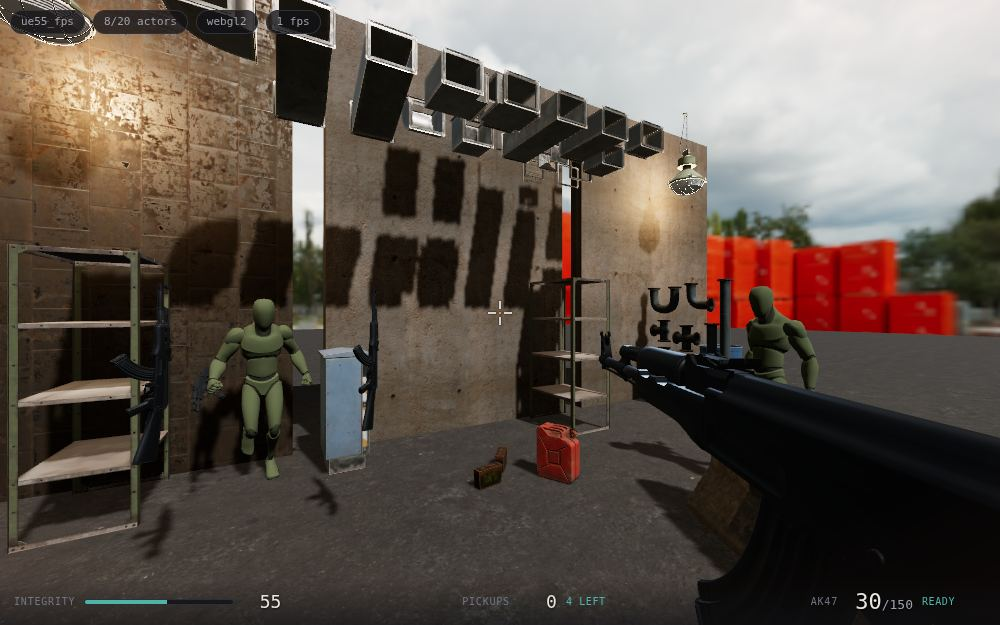
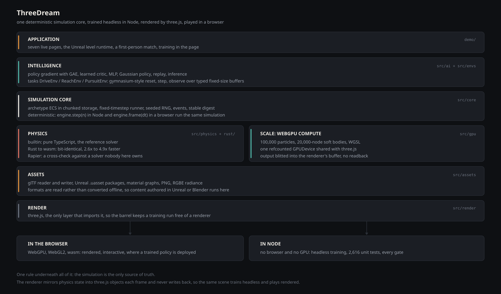
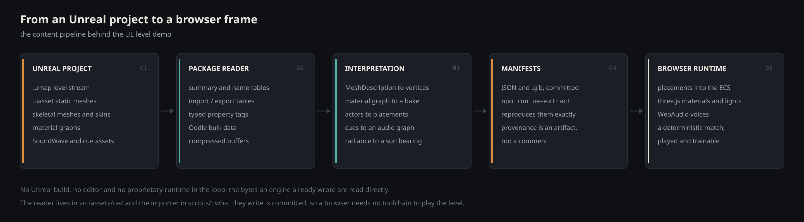
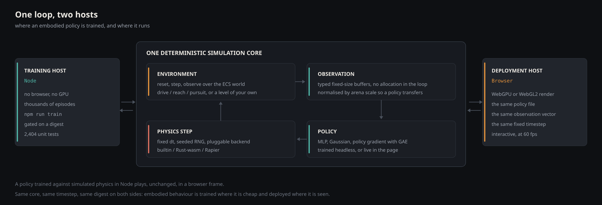
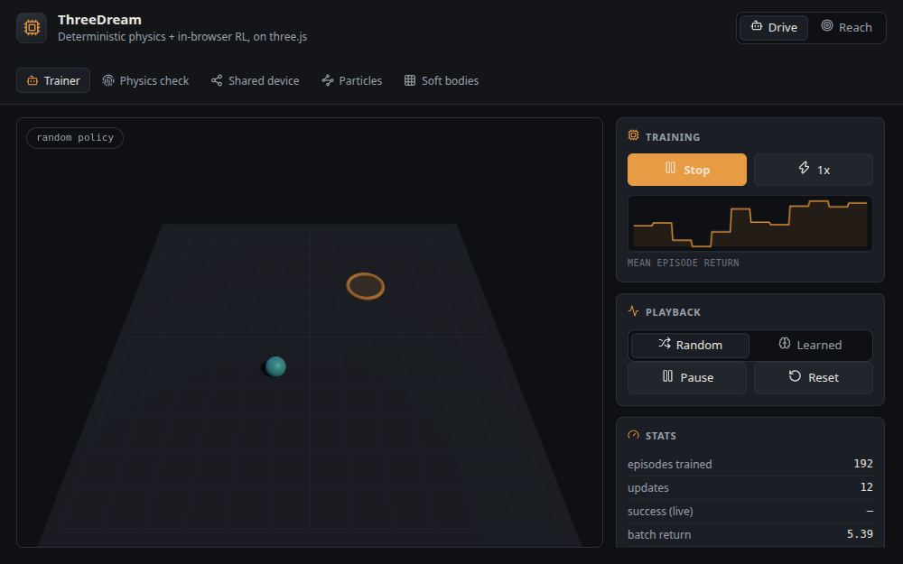
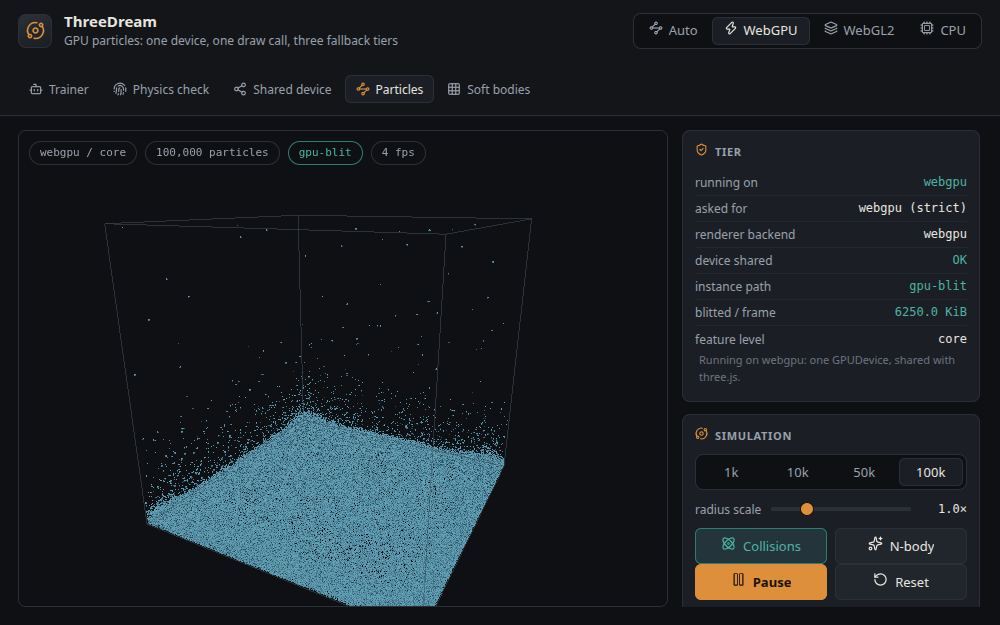
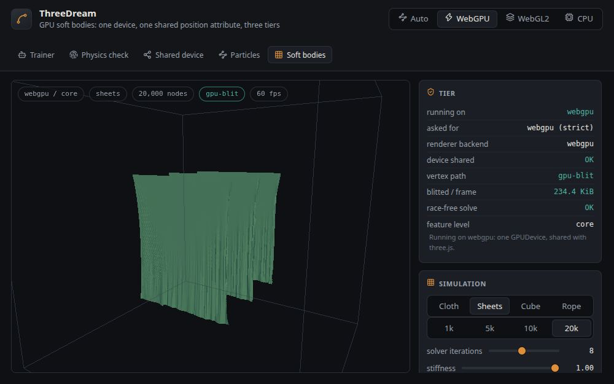
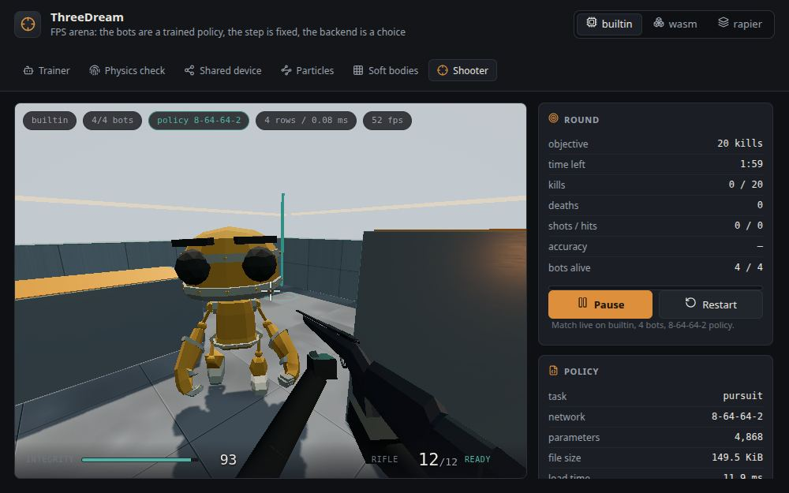
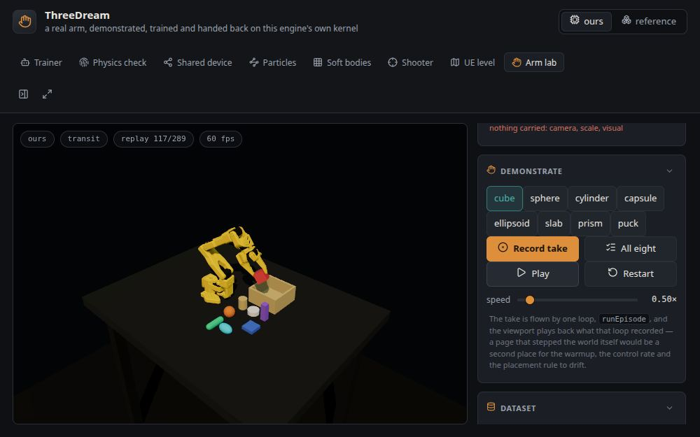

# ThreeDream

**An Unreal-class game engine and physics-AI runtime for the open web, built
toward photoreal fidelity: the first engine that adapts Unreal 5 games to a
browser tab, and a bridge between embodied intelligence and the physical
world.**

**面向开放 Web 的 Unreal 级游戏引擎与物理-AI 运行时，以超写实画面为目标：第一个把
Unreal 5 游戏适配进浏览器标签页的引擎，也是连接具身智能与物理世界的桥梁。**

ThreeDream reads an Unreal 5 project's own content — the level stream, static
and skeletal meshes, material graphs, data assets and `SoundWave`s — and plays
it in a browser tab: a deterministic ECS on a fixed timestep, a Rust physics
kernel compiled to wasm, and a WebGPU compute layer that carries particles and
soft bodies at scale. The same simulation core trains reinforcement policies
headlessly in Node and deploys them, unchanged, into the page: what an agent
learns against simulated physics is exactly what a player meets in the match.

ThreeDream 直接读取 Unreal 5 工程自己的内容——关卡流、静态与骨骼网格、材质图、数据
资产与 `SoundWave`——并在浏览器标签页里把它玩起来：固定步长上的确定性 ECS、编译为
wasm 的 Rust 物理内核、以及承载大规模粒子与软体的 WebGPU 计算层。同一套仿真核心在
Node 里无头训练强化策略，再原样部署进页面：智能体在模拟物理里学到的，就是玩家在对局
里遇到的。

[](https://robotworld.top/zh/threedream)
[](#open-source-coming-soon--开源在即)



*LeaffyL's UE5.5 FPS Demo, played as authored: the placements, the rifle, the
materials and the gunfire are the project's own bytes, read by this engine.*
*LeaffyL 的 UE5.5 FPS Demo，按原样游玩：摆放、步枪、材质与枪声都是工程自己的字节，由
本引擎读出。*

## Open source, coming soon / 开源在即

The source repository opens at
[github.com/flowinginthewind700/threedreamengine](https://github.com/flowinginthewind700/threedreamengine)
under the MIT licence; until then the demos, the assets and these documents are
already live, and the landing page plays every one of them in the browser.

源代码仓库将以 MIT 许可公开在
[github.com/flowinginthewind700/threedreamengine](https://github.com/flowinginthewind700/threedreamengine)；
在那之前，演示、资产与本文档都已经在线，落地页可以在浏览器里把每一个演示玩起来。

## Three claims / 三条主张

The goal is a photoreal, high-performance physics-AI engine that runs on the
open web. These are the three claims the repo measures today; every figure
below is read off a running page or a committed benchmark, and the fidelity
track continues in the roadmap.

目标是跑在开放 Web 上的超写实、高性能物理-AI 引擎。下面是仓库当前量得出来的三条主
张，其中每个数字都来自正在运行的页面或提交在仓库里的基准；画面保真这条线在路线图里
继续推进。

### Unreal 5 games, in a browser tab / Unreal 5 游戏，跑在浏览器标签页里

No editor, no native runtime, no offline export. The engine's own package
reader opens the project's `.umap` and `.uasset` files, and the import tool
turns them into a committed, playable asset set: actors become placements in
the ECS, material graphs become PBR materials the renderer binds, cues become
a WebAudio graph. What ships is reproducible from the source content, and the
page reports every substitution it had to make for content a project does not
ship.

无需编辑器、无需原生运行时、无需离线导出。引擎自带的包读取器直接打开工程的 `.umap`
与 `.uasset`，导入工具把它们变成一套提交在仓库里、可直接游玩的资源：actor 成为 ECS
里的摆放，材质图成为渲染器绑定的 PBR 材质，cue 成为 WebAudio 图。发布出去的一切都能
从源内容复现，而页面会如实报告它为工程未随附的内容所做的每一处替代。

### One deterministic core, every tier of hardware / 一个确定性核心，覆盖每一档硬件

An archetype ECS on a fixed timestep is the only source of truth; the renderer
mirrors it each frame and never writes back. Four physics backends implement
one interface: a pure-TypeScript reference, a first-party Rust kernel that
reproduces it bit for bit at 2.6-4.9x the speed, Rapier as an independent
cross-check, and MuJoCo, which is the one that carries a machine -- a robot
description read from URDF or MJCF is compiled by the solver itself, so a
policy trains against the links, joints and mass matrix a real file describes
rather than against boxes welded to nothing. Above them, a WebGPU compute
layer runs 100,000 particles and 20,000-node soft bodies on the same device
three.js renders with, blitting into the renderer's own buffers with no
readback; where a browser grants no WebGPU at all, a CPU path of the same code
keeps the page alive and says which tier it landed on.

固定步长上的 archetype ECS 是唯一事实来源；渲染层每帧镜像它，从不回写。四个物理后端
实现同一个接口：纯 TypeScript 参考实现、逐位复现它且快 2.6–4.9 倍的自研 Rust 内核、
作为独立交叉验证的 Rapier，以及带着一台机器的 MuJoCo——从 URDF 或 MJCF 读进来的机器人
描述由求解器自己编译，于是一个策略所训练的连杆、关节与质量矩阵，来自一份真实文件的
描述，而不是一堆焊在虚空里的盒子。其上是一层 WebGPU 计算层：10 万粒子与 2 万节点软体跑在
three.js 同一块设备上，直接 blit 进渲染器自己的 buffer，没有回读；浏览器完全不给
WebGPU 时，同一份代码的 CPU 路径让页面继续运行，并说明它落在了哪一档。

### Where embodied policies train, and where they live / 具身策略在哪里训练，在哪里生活

The simulation needs neither a browser nor a GPU, so training runs headless in
Node at the speed of a loop while the page plays the result at 60 fps: a
policy-gradient learner with GAE and a learned critic, gymnasium-style
environments over typed fixed-size buffers, and one policy file that means the
same thing on both hosts. Determinism is what makes the bridge honest — the
same seed replays the same world in a unit test, in a training run and in a
live match — so behaviour trained against simulated physics transfers to the
rendered world without an adaptation step.

That policy file is also a `.onnx` file. The same trunk runs through ONNX
Runtime Web as a second kernel and shares its decode with the TypeScript path,
so weights trained by a stack this repo does not own arrive through the same
door the ones trained here leave by — and the distance between the two kernels
is a number the suite measures, not an assumption anybody maintains.

A task is a document, not a file. A level's boxes, a robot description and one
JSON document — where the goal is, what a policy sees, what it may command, what
the reward is made of — compose into a trainable environment, and nothing between
the three is written per task: `npm run sim-env -- --task
demo/public/tasks/so101-reach-the-basket.json` takes the shipped example from an
untrained 0/20 to 10/10 over 320 episodes, headless, in about two minutes. A
document that misspells a reward term is refused with every reason at once rather
than training quietly into a policy that learned nothing, and what a composition
had to settle for — solids pruned by distance, ones too thin to collide — is
counted out loud. That is the surface the next milestone scales: one document,
many environments, one device.

仿真既不需要浏览器也不需要 GPU，因此训练在 Node 里以循环的速度无头运行，而页面以
60 fps 播放结果：带 GAE 与学习式 critic 的策略梯度学习器、类型化定长 buffer 上的
gymnasium 风格环境、以及在两个宿主上含义完全相同的同一份策略文件。确定性让这座桥
诚实——同一个种子在单元测试里、训练里、实时对局里回放出同一个世界——于是在模拟物理里
训练出的行为，无需适配步骤就能迁移到渲染出的世界。

这份策略文件同时也是一份 `.onnx`。同一个 trunk 经 ONNX Runtime Web 跑第二个内核，并与
TypeScript 路径共用同一个 decode，所以不是本仓库训练出来的权重，进出走的是同一扇门——
而两个内核之间的距离，是测试量出来的一个数，不是靠谁维护的一个假设。

任务是一份文档，不是一个文件。一个关卡的盒子、一份机器人描述、一份 JSON 文档（目标在哪、
策略看得见什么、能命令什么、reward 由什么组成）组合成一个可训练的环境，三者之间不为某个任务
新写一行代码：`npm run sim-env -- --task demo/public/tasks/so101-reach-the-basket.json` 把随仓库
发布的那个例子从未训练的 0/20 训到 10/10，320 局，无头，约两分钟。一份把 reward 项拼错的文档
会被一次报出全部原因地拒绝，而不是安静地训出一个什么也没学到的策略；一次组合不得不将就的东西
——按距离剪掉的固体、薄到无法碰撞的固体——都被数出来、报出来。这就是下一个里程碑要放大的那个
面：同一份文档，多个环境，一个设备。

## Architecture / 架构



*One core, layered so that no layer imports a dependency it does not own; the
same scene trains headless and plays rendered.*
*一个核心，分层方式保证任何一层都不引入不属于自己的依赖；同一个场景既能无头训练，也能
渲染游玩。*



*The content path: bytes an engine already wrote, read directly, committed as
manifests a browser can stream.*
*内容路径：直接读取引擎已经写下的字节，提交为浏览器可流式加载的 manifest。*



*The embodied loop: trained where it is cheap, deployed where it is seen, with
identical digests on both sides.*
*具身闭环：在便宜的地方训练，在被看见的地方部署，两侧摘要一致。*

The long form — every layer, solver, gate and measurement — lives in
[docs/architecture.md](docs/architecture.md).
长文——每一层、每个求解器、每道关卡与每一次测量——在
[docs/architecture.md](docs/architecture.md)。

## Demos / 演示页

Eight pages, served in-site at
[robotworld.top/threedream](https://robotworld.top/zh/threedream); the bundle
they run is the one `npm run build:inpage` writes after `npm run gate` has passed
every check. Each one exists to measure a claim rather than to illustrate it: the
numbers in the sidebars are read off the running engine.

一共八个页面，站内由
[robotworld.top/threedream](https://robotworld.top/zh/threedream) 提供；它们跑的那份
产物，是 `npm run gate` 把每一道关卡都跑绿之后由 `build:inpage` 写出来的。每个页面
存在的理由都是把一条结论量出来，而不是画个示意：侧栏里的数字都是从正在运行的引擎里
读出来的。

| Page | Live | What it measures |
|---|---|---|
| Trainer | [index](https://robotworld.top/threedream/app/) | A policy-gradient learner training in the page, on `DriveEnv` and `ReachEnv`. |
| Physics check | [physics-check.html](https://robotworld.top/threedream/app/physics-check.html) | One canonical scene through `builtin`, `wasm` and a wasm replay, digests compared in your own browser. |
| Shared device | [shared-device.html](https://robotworld.top/threedream/app/shared-device.html) | A single `GPUDevice` backing three.js rendering and a raw WGSL compute pipeline at the same time. |
| Particles | [particles.html](https://robotworld.top/threedream/app/particles.html) | 1k-100k particles: the tier the browser granted, blit or CPU upload, draw calls, hash overflow. |
| Soft bodies | [soft.html](https://robotworld.top/threedream/app/soft.html) | Cloth / sheets / cube / rope up to 20k nodes: islands, color batches, dispatches a step, the race-free flag, max stretch. |
| Shooter | [fps.html](https://robotworld.top/threedream/app/fps.html) | A first-person match: a trained pursuit policy drives the bots through the same fixed-step ECS, you drive the rifle, and the backend picker swaps `builtin` / `wasm` / `rapier` under a live round. |
| UE level | [ue-fps.html](https://robotworld.top/threedream/app/ue-fps.html) | An Unreal 5.5 project's own level, meshes, material graphs, data assets and `SoundWave`s, walked and heard in the browser; a 600-step scripted run publishes a digest pinned against the same match in bare Node. |
| Arm lab | [arm-lab.html](https://robotworld.top/threedream/app/arm-lab.html) | A real SO-101 workcell: an expert flies the take, a policy trained in the page flies it back, and both kernels agree with the same episode in bare Node on control steps, physics steps and where the block ends up. |

| 页面 | 线上 | 量的是什么 |
|---|---|---|
| 训练页 | [index](https://robotworld.top/threedream/app/) | 在页面里实时训练的策略梯度学习器，任务是 `DriveEnv` 与 `ReachEnv`。 |
| 确定性检查 | [physics-check.html](https://robotworld.top/threedream/app/physics-check.html) | 同一个规范场景跑 `builtin`、`wasm` 与一次 wasm 回放，在你自己的浏览器里比对摘要。 |
| 共享设备 | [shared-device.html](https://robotworld.top/threedream/app/shared-device.html) | 同一个 `GPUDevice` 同时支撑 three.js 渲染与一条裸 WGSL compute pipeline。 |
| 粒子 | [particles.html](https://robotworld.top/threedream/app/particles.html) | 1k–100k 粒子：浏览器实际给了哪个档位、走 blit 还是 CPU 上传、draw call 数、哈希溢出数。 |
| 软体 | [soft.html](https://robotworld.top/threedream/app/soft.html) | 布料 / 多片布 / 立方体 / 绳，最多 2 万节点：island 数、着色批次数、每步 dispatch 数、无竞争标志、最大拉伸。 |
| 射击 | [fps.html](https://robotworld.top/threedream/app/fps.html) | 一场第一人称对局：训练好的 pursuit 策略跑在同一个固定步长 ECS 里驱动 bots，你操控步枪，后端选择器可以在进行中的对局下切换 `builtin` / `wasm` / `rapier`。 |
| UE 关卡 | [ue-fps.html](https://robotworld.top/threedream/app/ue-fps.html) | 一个 Unreal 5.5 工程自己的关卡、网格、材质图、数据资产与 `SoundWave`，在浏览器里走起来也听得到；600 步脚本对局发布一个摘要，与裸 Node 里同一场对局的参照值比对。 |
| 机械臂 | [arm-lab.html](https://robotworld.top/threedream/app/arm-lab.html) | 一台真实的 SO-101 工作台：专家先飞一遍演示，页面里训练出的策略再把它飞回去；两个内核在控制步数、物理步数与方块最终落点上，都与裸 Node 里的同一段 episode 一致。 |

Every page carries the same nav strip, generated from the page list the build
reads, so arriving on any one of them shows the other seven. The screenshots here
and the share cards are real captures of these pages, each gated on the page's
own report first: a capture that silently fell back to a worse tier fails the
run rather than shipping under a caption it does not earn.

每个页面都带同一条导航条，由构建读取的同一份页面清单生成，所以落在任意一页都能看到
其余七页。这里与分享卡片用的截图都是这些页面的真实抓取，每张都先过页面自己报告的那
一关：真回退到更差档位的抓取会让脚本失败，而不是顶着一句它配不上的说明发出去。



*The learner training in the page: mean episode return on a sparkline, and the
learned policy switched into playback.*
*在页面里训练的学习器：火花线上的 mean episode return，以及切到回放的学习后策略。*



*100,000 particles on the tier the browser actually granted; `gpu-blit` means
the frame was copied on the device and never crossed the bus.*
*10 万粒子，跑在浏览器实际给出的档位上；`gpu-blit` 意味着这一帧在设备上拷贝完成，没有
过总线。*



*20,000 soft-body nodes in four sheets, solved in coloured constraint batches
on the device three.js renders with.*
*2 万软体节点分成四片布，在 three.js 渲染所用的设备上用着色的约束批次求解。*



*A live round: the bots run one pursuit policy trained in this repo, through
the same hitscan the player fires.*
*一场实时对局：bots 跑的是本仓库训练出的一个 pursuit 策略，走的是和玩家同一套
hitscan。*



*The arm lab mid-transit: the take the page recorded is playing back at half
speed, the red cube in the jaw on its way to the basket.*
*机械臂页的中途：页面自己录下的演示正在半速回放，红色方块夹在夹爪里，正送往篮子。*

## By the numbers / 关键数字

| | |
|---|---|
| 100,000 particles, one WebGPU step | 20-26 ms on an iGPU, median of 20 timed chunks |
| 20,000-node soft body, one step | 3.9-6.3 ms, race-free by constraint coloring, no atomics |
| Rust kernel against the TS reference | bit-identical digest, 2.6-4.9x faster in Node |
| Tests | 4,493 unit tests in 144 files, 67 browser tests, 68 Rust tests |
| Texture residency of a read-in UE level, 512 MiB budget | 2303.33 to 512.00 MiB across 380 maps: the budget filled to within 4.5 KiB, resolution spent instead of art, 2 maps pinned at 10.00 MiB |
| A task document to a trained policy | 320 episodes headless, 0/20 untrained to 10/10, ~2.3 min |
| Live pages | eight, in-site on robotworld.top, from a bundle built after every gate passed |

| | |
|---|---|
| 10 万粒子，一个 WebGPU 步 | iGPU 上 20–26 ms，20 个计时 chunk 的中位数 |
| 2 万节点软体，一个步 | 3.9–6.3 ms，靠约束着色无竞争，不用原子操作 |
| Rust 内核对 TS 参考实现 | 摘要逐位一致，Node 下快 2.6–4.9 倍 |
| 测试 | 144 个文件 4,493 个单元测试、67 个浏览器测试、68 个 Rust 测试 |
| 一张读进来的 UE 关卡的纹理驻留，512 MiB 预算 | 380 张图 2303.33 到 512.00 MiB：预算花到只差 4.5 KiB，花掉的是分辨率而不是画面，钉住的 2 张 10.00 MiB |
| 一份任务文档到一个训练好的策略 | 无头 320 局，未训练 0/20 到 10/10，约 2.3 分钟 |
| 线上页面 | 八个，robotworld.top 站内，产物出自一次全部关卡通过后的构建 |

## Quickstart / 快速开始

```bash
npm install
npm run dev       # the eight browser demos on http://localhost:5173
npm run train     # headless training in Node, prints a progress trace
npm test          # 4,493 unit tests, no GPU needed
npm run gate      # every gate, in order, stopping at the first red one
npm run gate:fast # the same, minus the wasm rebuild and the coverage pass
```

Requires Node >= 22.12. Rust is only needed to rebuild the physics kernel from
`rust/`; everything above runs without it.

需要 Node >= 22.12。只有从 `rust/` 重建物理内核时才需要 Rust；除 `gate` 的 Rust 关卡
之外，以上命令都不需要它。

## Roadmap / 路线图

- Unreal's height fog and sky, in the renderer's own fog model / 渲染器自己的雾模型里实现 UE 的高度雾与天空
- Decals, impact VFX, footstep IK, viewmodel materials / 贴花、打击特效、脚步 IK、viewmodel 材质
- A fully licensed scene pack in place of the stand-in kit / 以完全授权的场景包替换替代 kit
- Skeletal animation and emitter content from Unreal projects, through the import tool / 导入工具支持更多 Unreal 内容：骨骼动画与发射器
- Shared matches over the deterministic core / 在确定性核心之上的共享对局

## Further reading / 延伸阅读

- [docs/architecture.md](docs/architecture.md) — layers, solvers, gates, measurements / 分层、求解器、关卡与测量
- [docs/development-plan.md](docs/development-plan.md) — the roadmap in milestone form / 里程碑形式的路线图
- [docs/feasibility-rust-wasm-webgpu.md](docs/feasibility-rust-wasm-webgpu.md) — the feasibility study / 可行性调研
- [docs/free-assets.md](docs/free-assets.md) — the licence survey behind the shipped content / 发布内容背后的许可证调研

## License / 许可

MIT. See [LICENSE](LICENSE). / MIT，见 [LICENSE](LICENSE)。
